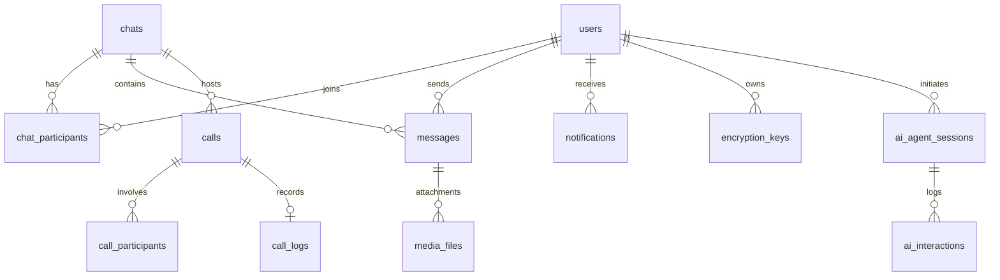

<p align="center">
  
  
  
</p>

# 🧠 NeuraChat — Intelligent Communication Platform

> *"Communicate Smarter. Connect Deeper."*

**NeuraChat** is a next-generation, AI-powered communication platform built as a Software Design & Architecture (SDA) course project during Semester 5 of the Computer Networks program. It seamlessly blends real-time messaging, voice/video calling, file sharing, and a built-in AI assistant into a single unified experience — empowering teams to communicate faster, smarter, and with less friction.

---

## 📑 Table of Contents

1. [Project Vision](#-project-vision)
2. [The Problem We Solve](#-the-problem-we-solve)
3. [Core Features](#-core-features)
4. [System Architecture](#-system-architecture)
5. [Technology Stack](#-technology-stack)
6. [Database Design](#-database-design)
7. [AI Engine — The Brain of NeuraChat](#-ai-engine--the-brain-of-neurachat)
8. [Real-Time Communication](#-real-time-communication)
9. [SDA Project Lifecycle](#-sda-project-lifecycle)
10. [Team Members & Contributions](#-team-members--contributions)
11. [Deployment & Infrastructure](#-deployment--infrastructure)
12. [Future Roadmap](#-future-roadmap)

---

## 🔭 Project Vision

The idea behind NeuraChat was born from a simple observation: **modern communication is fragmented.** Teams juggle between messaging apps, email clients, video conferencing tools, AI writing assistants, and file-sharing services — constantly switching context, losing productivity, and breaking flow.

We envisioned a platform that doesn't just connect people, but **augments their communication** with artificial intelligence at every step. NeuraChat is not merely another chat application — it is a **communication co-pilot** that:

- **Understands** what you're trying to say and helps you say it better
- **Adapts** to the tone and context of your conversations
- **Bridges** language barriers with real-time translation
- **Unifies** messaging, calling, file sharing, and AI assistance into one seamless workflow

Our guiding principle was clear:

> *"The best tool is the one you never have to leave."*

We wanted to build a platform where a user could draft a message, have AI refine and translate it, share a file, and jump into a video call — all without ever leaving the same interface.

---

## 🎯 The Problem We Solve

| Pain Point | How NeuraChat Addresses It |
|---|---|
| **Context Switching** | All communication tools live under one roof — chat, calls, AI, and file sharing |
| **Poor Message Quality** | Built-in AI grammar correction, enhancement, and expansion tools elevate every message |
| **Language Barriers** | Real-time AI translation across any language pair |
| **Scattered Files** | Integrated media sharing system with thumbnails, type filtering, and per-chat galleries |
| **No Smart Assistance** | A dedicated AI Agent that remembers session context and helps with any query |
| **Rigid Communication** | Tone adjustment (casual, formal, empathetic) lets users adapt their voice to any audience |

---

## ✨ Core Features

### 💬 Real-Time Messaging
- Instant message delivery via **Socket.IO** with delivery/read receipts
- **Private** and **Group** chat support with admin/member roles
- Typing indicators for live presence awareness
- Message editing and deletion
- Observer-pattern sidebar updates for real-time chat list synchronization

### 📞 Voice & Video Calling
- High-quality **audio & video calls** powered by **Agora RTC SDK**
- Real-time call signaling through Socket.IO
- Call states: initiating → ringing → connected → ended
- 20-second auto-timeout for unanswered calls
- Full call history and duration logging
- Incoming call modal with caller avatar and name
- Floating call bar for multitasking during active calls

### 🤖 AI-Powered Features
- **Grammar Correction** — Fix spelling and grammatical errors instantly
- **Message Summarization** — Condense long messages into key points
- **Message Enhancement** — Improve clarity and readability
- **Message Expansion** — Expand short ideas into full drafts
- **Tone Adjustment** — Rewrite in casual, formal, or empathetic tone
- **Translation** — Translate messages into any target language
- **AI Agent** — A dedicated conversational assistant with full session history powered by **LangChain + LangGraph**

### 📁 File Sharing & Media Management
- Upload and share images, videos, audio, documents, and files
- Automatic file type categorization and thumbnail generation
- Per-chat media gallery with type-based filtering
- Media statistics (file counts, total size by type)
- Upload/download/delete with role-based access control (uploader or admin)
- Real-time file event broadcasting to all chat participants

### 🔐 Authentication & Security
- Secure registration and login via **Supabase Auth**
- **JWT-based** session management with HTTP-only cookies
- Forgot password and reset password flows
- **Signal Protocol** encryption key infrastructure (identity keys, signed pre-keys, one-time pre-keys)
- Encryption session management with Double Ratchet state
- Key rotation logging for security auditing

### 🔔 Notifications
- Real-time notification delivery for new messages, calls, and system events
- Per-notification read/unread status
- Chat-linked notifications for contextual navigation

### 👤 User Profiles
- Customizable profiles with username, full name, avatar, and status message
- Last seen tracking
- Per-user AI provider/model preferences
- Profile editing and password change modals

---

## 🏗 System Architecture

NeuraChat follows a **clean, layered architecture** with clear separation of concerns:

```
┌──────────────────────────────────────────────────────────────────┐
│                        FRONTEND (Next.js 15)                     │
│  ┌──────────┐ ┌──────────┐ ┌──────────┐ ┌──────────────────┐    │
│  │ App Pages│ │Components│ │  Hooks   │ │  Context (Auth)  │    │
│  └────┬─────┘ └────┬─────┘ └────┬─────┘ └────────┬─────────┘    │
│       └─────────────┴────────────┴────────────────┘              │
│                         │                                        │
│              ┌──────────┴──────────┐                             │
│              │    lib/ (API, Agora, │                             │
│              │   Socket, RTM, Store)│                             │
│              └──────────┬──────────┘                              │
└─────────────────────────┼────────────────────────────────────────┘
                          │ REST API + WebSocket
┌─────────────────────────┼────────────────────────────────────────┐
│                     BACKEND (Express.js + TypeScript)             │
│  ┌────────┐  ┌───────────┐  ┌──────────┐  ┌────────────────┐    │
│  │ Routes │──│Controllers│──│ Services │──│   Middleware    │    │
│  └────────┘  └───────────┘  └──────────┘  └────────────────┘    │
│                                  │                               │
│              ┌───────────────────┼──────────────────┐            │
│              │         AI Service Layer             │            │
│              │  ┌──────────┐  ┌──────────────────┐  │            │
│              │  │ Adapters │  │  Agent (LangGraph)│  │            │
│              │  │(Gemini,  │  │  + Tools + History│  │            │
│              │  │ Ollama)  │  └──────────────────┘  │            │
│              │  └──────────┘                        │            │
│              └──────────────────────────────────────┘            │
│                          │                                       │
│  ┌───────────────────────┼──────────────────────────────────┐    │
│  │        Socket.IO Server (Real-time Events)               │    │
│  │  Messages · Typing · Calls · Files · Notifications       │    │
│  └──────────────────────────────────────────────────────────┘    │
└──────────────────────────┼───────────────────────────────────────┘
                           │
┌──────────────────────────┼───────────────────────────────────────┐
│                    SUPABASE (Cloud Backend)                       │
│  ┌──────────┐  ┌──────────────┐  ┌──────────────────────────┐   │
│  │   Auth   │  │  PostgreSQL  │  │   Object Storage         │   │
│  │  (Users) │  │  (14 Tables) │  │   (Media Bucket)         │   │
│  └──────────┘  └──────────────┘  └──────────────────────────┘   │
└──────────────────────────────────────────────────────────────────┘
```

---

## 🛠 Technology Stack

### Frontend
| Technology | Purpose |
|---|---|
| **Next.js 15** | React framework with App Router and Turbopack |
| **React 19** | UI component library |
| **TypeScript** | Type-safe development |
| **Tailwind CSS 4** | Utility-first styling |
| **Socket.IO Client** | Real-time WebSocket communication |
| **Agora RTC SDK** | Voice & video calling engine |
| **Agora RTM SDK** | Real-time messaging signaling layer |
| **Supabase Client** | Direct database and auth interactions |

### Backend
| Technology | Purpose |
|---|---|
| **Express.js** | REST API framework |
| **TypeScript** | Type-safe server-side code |
| **Socket.IO** | WebSocket server for real-time events |
| **LangChain** | AI orchestration framework |
| **LangGraph** | Stateful AI Agent with tool-calling |
| **Google Gemini** | Primary AI provider (grammar, tone, translation, agent) |
| **Ollama (DeepSeek R1)** | Self-hosted AI provider alternative |
| **Supabase JS** | Database client (PostgreSQL) |
| **JWT (jsonwebtoken)** | Authentication tokens |
| **bcrypt** | Password hashing |
| **Multer** | File upload handling |
| **Agora Access Token** | RTC/RTM token generation |
| **Zod** | Runtime schema validation |
| **Axios** | HTTP client for external APIs |

### Infrastructure
| Technology | Purpose |
|---|---|
| **Supabase** | Managed PostgreSQL, Auth, and Object Storage |
| **Render** | Backend deployment (Node.js) |
| **Vercel** | Frontend deployment (Next.js) |

---

## 🗄 Database Design

NeuraChat's database is built on **PostgreSQL** (via Supabase) and consists of **14 interconnected tables** organized across five functional domains:

### Entity-Relationship Overview



### Table Summary

| Domain | Tables | Description |
|---|---|---|
| **Core** | `users`, `chat_participants` | User profiles synced from Supabase Auth; composite-PK join table linking users to chats |
| **Messaging** | `chats`, `messages`, `media_files` | Private/group chats, encrypted messages (text/media/system), and file metadata with storage URLs |
| **AI** | `ai_agent_sessions`, `ai_interactions` | Per-user singleton sessions with full query/response history and intent classification |
| **Calling** | `calls`, `call_participants`, `call_logs` | Audio/video call records, per-user participant status tracking, and quality/duration logs |
| **Security** | `encryption_keys`, `used_prekeys`, `key_rotation_logs`, `encryption_sessions` | Signal Protocol key bundles, pre-key usage tracking, rotation auditing, and Double Ratchet session state |
| **System** | `notifications` | Multi-type notification system (message, call, system) with read status |

### Key Design Decisions
- **UUID primary keys** throughout for global uniqueness and security
- **Composite primary keys** on join tables (`chat_participants`, `call_participants`) to prevent duplicates
- **Database triggers** for automatic user profile creation on signup
- **Row Level Security** disabled during development (noted for production enablement)
- **Indexed foreign keys** on media files for optimized gallery queries

---

## 🤖 AI Engine — The Brain of NeuraChat

The AI subsystem is the crown jewel of NeuraChat — a multi-provider, adapter-pattern architecture that powers every intelligent feature:

### Architecture Pattern: Strategy + Adapter

```
┌─────────────────────────────────┐
│         AI Controller           │  ← Resolves config: Body → DB Pref → Env Default
│   (Request Handler Layer)       │
└──────────┬──────────────────────┘
           │
┌──────────▼──────────────────────┐
│          AIService              │  ← Facade with grammar/summarize/enhance/expand/
│    (Strategy Coordinator)       │     tone/translate/agent methods
└──────────┬──────────────────────┘
           │
    ┌──────┴──────┐
    ▼             ▼
┌────────┐  ┌──────────┐
│ Gemini │  │  Ollama  │   ← Provider Adapters implementing AIProvider interface
│Adapter │  │ Adapter  │
└────────┘  └──────────┘

           +

┌─────────────────────────────────┐
│        AgentService             │  ← LangGraph-powered stateful agent
│  (LangChain + Tools + History)  │     with tool-calling capability
└─────────────────────────────────┘
```

### AI Features Breakdown

| Feature | System Prompt | Input | Output |
|---|---|---|---|
| Grammar Correction | `GRAMMAR` | Raw text | Corrected text |
| Summarization | `SUMMARIZER` | Long text | Concise summary |
| Enhancement | `ENHANCE` | Draft text | Clearer, improved text |
| Expansion | `EXPAND` | Short text | Full elaborated draft |
| Tone: Casual | `TONE_CASUAL` | Any text | Casual rewrite |
| Tone: Formal | `TONE_FORMAL` | Any text | Professional rewrite |
| Tone: Empathetic | `TONE_EMPATHETIC` | Any text | Empathetic rewrite |
| Translation | Dynamic prompt | Text + target language | Translated text |
| AI Agent Chat | `AGENT` | User query + session history | Contextual response |

### Provider Priority Resolution
The AI system follows a **three-level fallback** for selecting the AI provider:
1. **Request Body Override** — Caller can explicitly specify a provider
2. **User Database Preference** — Each user can set a preferred provider in their profile
3. **Server Environment Default** — Falls back to the `AI_PROVIDER` env variable (defaults to Gemini)

---

## 📡 Real-Time Communication

### Socket.IO Event Architecture

NeuraChat's real-time layer handles five major event categories:

| Category | Events | Description |
|---|---|---|
| **Messaging** | `send-message`, `new-message`, `chat:updated` | Full message lifecycle — save to DB, broadcast to chat room, trigger sidebar updates |
| **Typing** | `typing`, `stop-typing`, `user-typing`, `user-stop-typing` | Live typing indicators per chat room |
| **Calls** | `call-initiate`, `incoming-call`, `call-accepted`, `call-rejected`, `call-ended` | Full call signaling with Agora token generation on acceptance |
| **Files** | `file-uploaded`, `new-file`, `file-deleted`, `file-removed` | Real-time file sharing notifications across chat participants |
| **Connection** | `join`, `join-chat`, `disconnect` | Room management and automatic call cleanup on disconnect |

### Call Flow

```
   Caller                    Server                   Recipient
     │                         │                          │
     │──call-initiate────────► │                          │
     │                         │──incoming-call─────────► │
     │◄─call-initiated─────── │                          │
     │                         │                          │
     │         ┌───── 20s Timeout (auto-reject) ──────┐  │
     │         │               │                      │  │
     │                         │◄─call-accepted─────── │
     │                         │                          │
     │                   [Generate Agora Tokens]          │
     │                   [Unique UID per user  ]          │
     │                         │                          │
     │◄─call-accepted (token)─ │─call-accepted (token)──► │
     │                         │                          │
     │         [Agora RTC Channel Connected]              │
     │◄═══════════════ LIVE CALL ══════════════════════► │
     │                         │                          │
     │──call-ended───────────► │                          │
     │                         │──call-ended────────────► │
     │                   [Update DB: duration, status]    │
```

---

## 📋 SDA Project Lifecycle

NeuraChat was developed following a structured **Software Design & Architecture** methodology across four phases:

### Phase 0: Proposal
- **Product Requirements Document (PRD)** defining scope, target users, and feature priorities
- Initial project proposal presentation

### Phase 1: Analysis & Requirements
- **Use Case Diagrams** with detailed actor-system interactions
- **Use Case Descriptions** for all 15+ major use cases
- **Class Diagrams** defining entity relationships and method signatures
- Requirements specification document

### Phase 2: Design
- **Enhanced Entity-Relationship Diagram (EERD)** with all 14 entities and relationships
- **Design Class Diagram** with detailed attribute types and associations
- **UML Diagrams** for critical use cases:
  - Sequence Diagrams (UC13, UC14, UC15)
  - Activity/Swimlane Diagrams
  - State Diagrams
- Full database schema with SQL DDL

### Phase 3: Implementation & UI
- **Figma Prototypes** for the complete UI ([Figma Link](https://www.figma.com/design/Lpun69t70f9f3w1BWAqe3k/NeuraChat))
- Full-stack implementation with:
  - Backend API with 8 route modules and 8 controllers
  - Frontend with 24+ React components and 4 custom hooks
  - Postman collection for API testing (33KB+ of documented endpoints)

---

## 👥 Team Members & Contributions

### 🟤 Qatada — *Project Lead & Backend Architect*

Qatada served as the driving force behind NeuraChat, establishing the project vision and leading the team from concept to deployment. As the backend architect, he designed and implemented the entire server-side infrastructure:

**Key Contributions:**
- Designed the overall system architecture and established the tech stack decisions
- Built the **Express.js server** with the complete Socket.IO real-time event system (693 lines of server orchestration)
- Implemented the full **call signaling system** — from initiation through Agora token generation to call cleanup on disconnect
- Designed the **14-table PostgreSQL schema** with proper foreign key constraints, indexes, and database triggers
- Wrote the **Render deployment configuration** and managed CI/CD pipelines
- Created the **Postman API Collection** documenting all endpoints for team-wide testing
- Authored the **SDA Phase 1 & Phase 2** deliverables including use case descriptions and the EERD

---

### 🟢 Saad — *AI Systems Engineer & API Developer*

Saad was the mind behind NeuraChat's intelligent features, architecting the entire AI subsystem from the ground up. His adapter-pattern design allowed NeuraChat to seamlessly switch between AI providers:

**Key Contributions:**
- Architected the **multi-provider AI Service** using the Strategy + Adapter design pattern
- Built the **Gemini Adapter** and **Ollama Adapter** with a unified `AIProvider` interface
- Developed the **LangGraph-powered AI Agent** with tool-calling capabilities, session history management, and context-aware responses
- Implemented all 7 AI feature endpoints: grammar correction, summarization, enhancement, expansion, tone adjustment, translation, and agent chat
- Designed the **3-level provider resolution** system (request → DB preference → env default)
- Created the AI configuration prompts and the translation prompt generator
- Built the **AI preferences system** allowing per-user provider and model selection
- Contributed to the encryption key infrastructure and the Signal Protocol schema design

---

### 🔵 Anees — *Frontend Engineer & UI/UX Designer*

Anees transformed NeuraChat from a backend-only API into a beautiful, responsive, and production-ready web application. His component architecture ensured every interaction felt smooth and intuitive:

**Key Contributions:**
- Built the entire **Next.js 15 frontend** with App Router, Turbopack, and React 19
- Designed and implemented the **warm mocha/coffee-themed UI** with a cohesive color palette (#F5EFEA, #8B5E3C, #6B4A2F, #3A2A20)
- Created **24+ React components** including:
  - `DashboardChatArea` — The main messaging interface with real-time updates
  - `MessageList` & `MessageItem` — Virtualized message rendering with media support
  - `ChatListFull` & `ChatListItem` — Sidebar chat list with last-message previews
  - `AIMessageAssistant` — The integrated AI toolbar within the chat composer
  - `FileUploadModal` — Drag-and-drop file sharing with progress indicators
  - `NewChatModal` — User search and chat creation flow
  - `UserProfileModal` & `EditProfileModal` — Profile viewing and editing
  - `NotificationPanel` — Real-time notification feed
  - `ChangePasswordModal` — Secure password update flow
- Built the **marketing landing pages** (Home, About, Services, Contact) with the `MarketingShell` layout
- Designed the **Figma prototype** for the complete application (Phase 3)
- Implemented **responsive layouts** that work seamlessly across desktop and mobile

---

### 🟡 Ezaan — *Real-Time Systems & Calling Engineer*

Ezaan was responsible for the real-time infrastructure that makes NeuraChat feel alive. From WebSocket communication to voice/video calling, he ensured every interaction happened instantaneously:

**Key Contributions:**
- Implemented the **Agora RTC integration** — the complete voice and video calling pipeline (~25,000 bytes of Agora SDK orchestration)
- Built the **Agora RTM (Real-Time Messaging)** signaling layer for call coordination
- Created the **call UI components**:
  - `in-call-ui.tsx` — Audio call interface with mute/unmute and speaker toggle
  - `in-call-video-ui.tsx` — Video call interface with camera switching and screen layout (~21KB)
  - `incoming-call-modal.tsx` — Incoming call alert with accept/reject
  - `outgoing-call-ui.tsx` — Ringing/calling state UI
  - `call-floating-bar.tsx` — Minimized call bar for background calling
- Developed the custom **`useCall` hook** (~26KB) — the centralized call state manager handling:
  - Call initiation, acceptance, rejection, and cleanup
  - Agora token management and channel joining
  - Audio/video track lifecycle (create, publish, unpublish, destroy)
  - Automatic call cleanup on socket disconnect
- Built the **callSessionStore** for cross-component call state persistence
- Implemented the **Socket.IO client** library with authentication, reconnection, and event management
- Designed the **Call Logs page** with call history, duration display, and participant details
- Contributed to the **UML sequence and state diagrams** for calling use cases (UC13, UC14, UC15)

---

## 🚀 Deployment & Infrastructure

NeuraChat is deployed as a **distributed system** across three managed cloud platforms:

| Layer | Platform | URL Pattern |
|---|---|---|
| **Frontend** | Vercel | `neurachat.vercel.app` |
| **Backend** | Render | `neurachat-backend.onrender.com` |
| **Database + Auth + Storage** | Supabase | Managed PostgreSQL + Auth + S3-compatible bucket |

### Environment Variables

The backend is configured with the following environment variables:

| Variable | Purpose |
|---|---|
| `SUPABASE_URL`, `SUPABASE_ANON_KEY`, `SUPABASE_SERVICE_ROLE_KEY` | Database connectivity |
| `JWT_SECRET`, `JWT_EXPIRES_IN` | Authentication token configuration |
| `FRONTEND_URL` | CORS origin whitelist |
| `AI_PROVIDER`, `GEMINI_API_KEY`, `HF_API_KEY` | AI provider configuration |
| `OLLAMA_MODEL`, `OLLAMA_HOST` | Self-hosted AI configuration |
| `AGORA_APP_ID`, `AGORA_APP_CERTIFICATE` | Voice/video calling credentials |

---

## 🔮 Future Roadmap

| Feature | Description | Status |
|---|---|---|
| End-to-End Encryption | Full Signal Protocol implementation with Double Ratchet | Schema designed, implementation pending |
| Row Level Security | Enable Supabase RLS policies for production | Planned |
| Group Video Calls | Multi-participant video conferencing | Architecture ready |
| Push Notifications | Mobile and browser push notifications | Planned |
| Message Reactions | Emoji reactions on messages | Planned |
| Threads | Reply threads within conversations | Planned |
| AI Image Analysis | AI-powered analysis of shared images | Planned |
| Dark/Light Theme Toggle | User-selectable theme with system preference detection | Planned |

---

## 📄 License & Acknowledgments

NeuraChat was built as an academic project for the **Software Design & Architecture** course (Semester 5, Computer Networks). The project demonstrates full-stack architectural principles, real-time systems design, AI integration patterns, and cloud-native deployment strategies.

**Special thanks** to our course instructor for the guidance and structured SDA methodology that shaped this project from a simple chat app idea into a comprehensive communication platform.

---

<p align="center">
  <strong>Built with ❤️ by Team NeuraChat</strong><br/>
  <em>Qatada · Saad · Anees · Ezaan</em>
</p>
